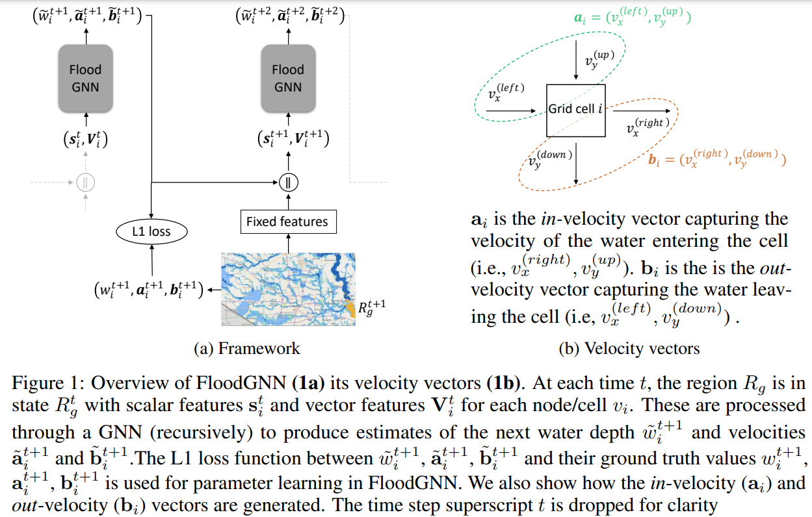

# FloodGNN

Source code for ["Flood Prediction with Graph Neural Networks"](https://www.climatechange.ai/papers/neurips2022/75). 

## Required Packages
* Python == 3.8
* [PyTorch](https://pytorch.org/) == 1.11
* [PyTorch Geometry](https://pytorch-geometric.readthedocs.io/) == 2.0
* Scikit-learn == 1.1

## Usage
    python train.py <parameters>  
